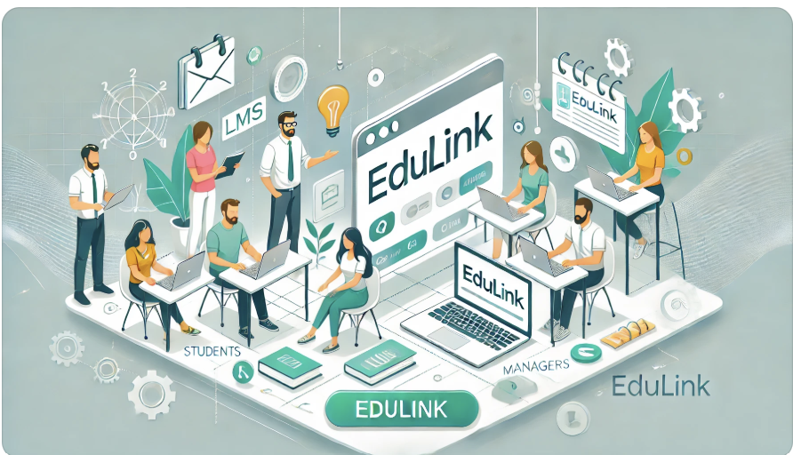
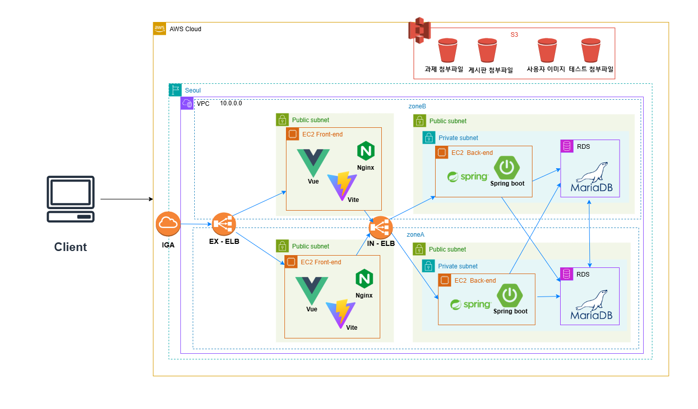
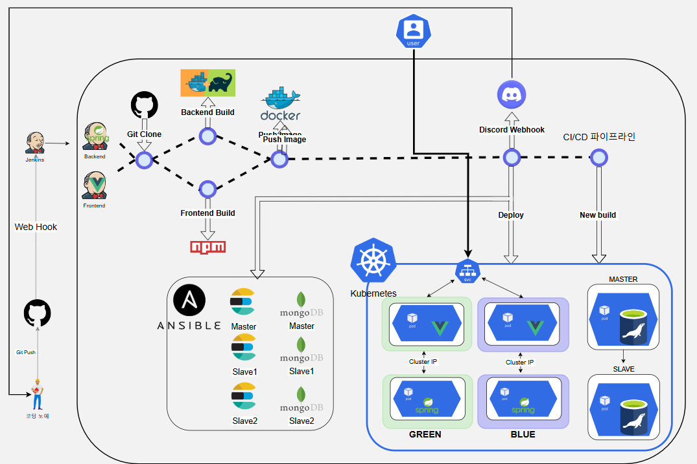
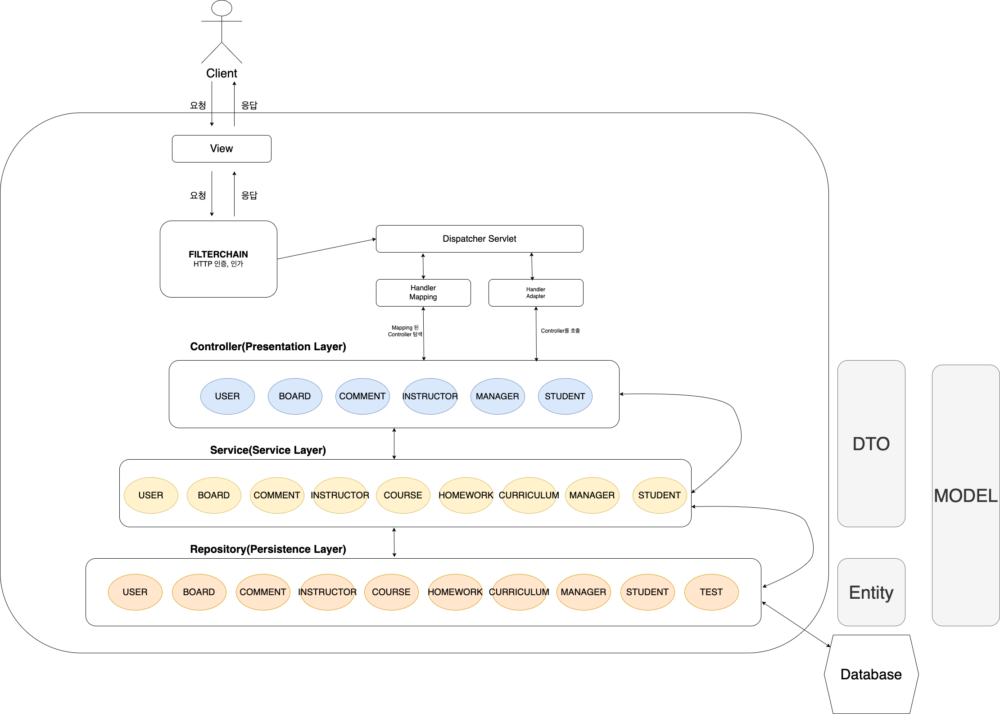

# be12-404Error-EduLink

## 📌 프로젝트 주제 
### EduLink: 혁신적인 학습 관리 플랫폼

      

빠르게 증가하는 국비지원 부트캠프 수요에 맞춰 학습 환경의 질적 향상을 목표로 개발된 EduLink는 기존 LMS(HRD-Net)의 한계를 보완합니다.   

이 플랫폼은 단순 출결 확인을 넘어 커리큘럼 관리, 공지사항 통합, 학습 성과 분석 등 다양한 기능을 통해 학습 효율을 극대화합니다.   

수강생들은 EduLink를 통해 학습 전반을 체계적으로 관리하고 편리하게 활용할 수 있습니다.

[프로젝트 개요 보기](https://github.com/museongkim0/edulink/wiki/1.-%ED%94%84%EB%A1%9C%EC%A0%9D%ED%8A%B8-%EA%B0%9C%EC%9A%94)

### 프로젝트 목표

프론트엔드 프로젝트 목표

- 직관적이고 편리한 UI/UX를 통해 학습자와 강사, 매니저가 쉽게 접근하고 활용할 수 있는 프론트엔드를 설계합니다.
- 학습 진도, 과제 제출 상태, 평가 결과를 시각적으로 확인할 수 있는 대시보드를 개발합니다.
- 권한에 따라 다르게 대시보드를 다르게 구성하여 사용자 구분에 적합한 기능을 제공합니다.

백엔드 프로젝트 목표

- EduLink 서비스의 백엔드 서버를 구현하고, 이전에 개발한 프론트엔드 서버와 연결합니다.
- 기본적인 기능 구현에서 나아가 여러 시나리오 기반으로 성능을 테스트하고 개선합니다.
- 구현된 기능의 문제점을 효율적으로 보완하기 위해 고도화합니다.

데브옵스 프로젝트 목표

- EduLink 서비스에서 Jenkins, Kubernetes, Ansible을 활용하여 코드 변경부터 배포까지의 CI/CD 프로세스를 자동화하고, 블루/그린 배포 방식을 통해 무중단 배포를 실현합니다.
- Ansible을 이용해 Elasticsearch와 MongoDB의 설치 및 관리를 자동화함으로써 일관된 환경을 유지하고 운영 효율성을 높이는 것을 목표로 합니다.
- 디스코드 알림과 빠른 롤백 메커니즘을 도입하여 시스템 안정성을 보장하고 사용자 경험을 지속적으로 유지하는 데 중점을 둡니다.

## 💡팀

    
    <h3>한화시스템 BEYOND SW캠프 </h3>
    
12기 미니 프로젝트 <strong>팀 404Error</strong>

## 🤚 404Error 팀원

  <table  align="center">
    <tbody>
      <tr>
        <td align="center"><a href="https://github.com/museongkim0" style="text-decoration: none; color: lightgray;"> <b> 🐯 김무성</b></a> </td>
        <td align="center"><a href="https://github.com/kuj7882" style="text-decoration: none; color: lightgray;"> <b> 🐶 김유진</b></a> </td>
        <td align="center"><a href="https://github.com/GoodLeaf" style="text-decoration: none; color: lightgray;"> <b> 🐺 김정엽</b></a> </td>
        <td align="center"><a href="https://github.com/gunha0405" style="text-decoration: none; color: lightgray;"> <b> 🐱 오건하</b></a> </td>
        <td align="center"><a href="https://github.com/leewoojin12" style="text-decoration: none; color: lightgray;"> <b> 🦁 이우진</b></a> </td>
      </tr>
    </tbody>
  </table>

<!--
## ⭐ 접속 주소

**서비스 접속 주소** 
<a href="http://www.edulink.kro.kr">www.edulink.kro.kr</a> 

테스트 계정

- 학생 : student@test.com
- 강사 : instructor@test.com
- 매니저 : manager@test.com
- 비밀번호 : qwer1234

-->

## 🔧 기술 스택

프론트엔드  
 
 
  

백엔드  
   

DB 
 

AWS 클라우드  
 
 
 

데브옵스(CI/CD)  
 

 

협업 툴  

 

## 🖥️ 시스템 아키텍쳐

### ☁️ AWS 시스템 아키텍처

- 기능 테스트를 위한 서비스 접속 주소는 AWS 시스템 아키텍처를 통해 배포됩니다.

### 🏁 최종 시스템 아키텍처

## 👩‍💻 소프트웨어 아키텍처
 
 

- 유지보수성과 확장성을 위해 MVC(Model-View-Controller)와 레이어드 아키텍처(Layered Architecture)를 적용하여 역할을 명확히 분리하고, 코드의 가독성과 재사용성을 높였습니다.

## 📃 API 명세서
<a href="http://www.edulink-back-api.kro.kr:8080/swagger-ui/index.html">API 명세서</a>

## 📝 기획 & DB구성 프로젝트
[기획 & DB구성 프로젝트 깃헙 링크](https://github.com/beyond-sw-camp/be12-1st-404Error-EduLink)

## 🎨 프론트엔드 프로젝트
[프론트엔드 프로젝트 깃헙 링크](https://github.com/beyond-sw-camp/be12-2nd-404Error-EduLink)

## ⚙️ 백엔드 프로젝트
[백엔드 프로젝트 깃헙 링크](https://github.com/beyond-sw-camp/be12-3rd-404Error-EduLink)

## 🚀 데브옵스 프로젝트
[데브옵스 프로젝트 깃헙 링크](https://github.com/beyond-sw-camp/be12-4th-404Error-EduLink)
